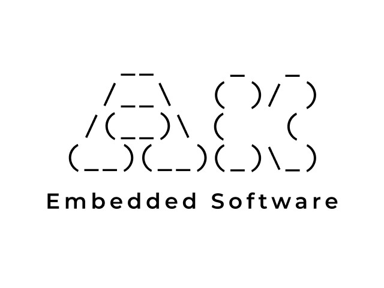

# “SPACE SHOOTING” GAME ON AK EMBEDDED BASE KIT

---

#### Table of Contents

- [**Introduction**](#introduction)
- [**Hardware**](#hardware)
    - [**Memory Map**](#memory-map)
- [**How “Space Shooting” is played**](#how-space-shooting-is-played)
    - [**Game active objects**](#game-active-objects)
    - [**Inputs**](#inputs)
    - [**Points calculation**](#points-calculation)
- [**“Space Shooting” game design**](#space-shooting-game-design)
    - [**UML sequence**](#uml-sequence)
    - [**Asteroid**](#asteroid)
    - [**Terrain**](#terrain)
    - [**Player ship and enemy ship**](#player-ship-and-enemy-ship)
    - [**Player missile and enemy missile**](#player-missile-and-enemy-missile)
- [**Display in “Space Shooting” Game**](#display-in-space-shooting-game)
- [**Reference**](#reference)

---

### Introduction

[](https://github.com/epcbtech)

AK Embedded Base Kit is an evaluation kit for advanced embedded software learners.
- The KIT integrates 1.3" Oled LCD, 3 push buttons, and 1 Buzzers that play music, to learn the event-driven system through hands-on game machine design.
- The KIT also integrates RS485, NRF24L01+, and Flash up to 32MB, suitable for prototyping practical applications in embedded systems such as: wired communication, wireless wireless, data logger storage applications,...

[](https://epcb.vn/products/ak-embedded-base-kit-lap-trinh-nhung-vi-dieu-khien-mcu)  
*Figure 1: AK Embedded Base Kit*<br>  
**“Space Shooting”** is an AK Embedded Base Kit using state machine and event-driven programming to operate. The report will document the game play, active objects, and how each active object function.

### Hardware
[](https://epcb.vn/products/ak-embedded-base-kit-lap-trinh-nhung-vi-dieu-khien-mcu)  
*Figure 2.1: In front of main board*

[](https://epcb.vn/products/ak-embedded-base-kit-lap-trinh-nhung-vi-dieu-khien-mcu)  
*Figure 2.2: Back of main board*

#### Memory map
    
- [ 0x08000000 ] : **Boot** [[ak-base-kit-stm32l151-boot.bin]](https://github.com/epcbtech/ak-base-kit-stm32l151/blob/main/hardware/bin/ak-base-kit-stm32l151-boot.bin)
- [ 0x08002000 ] : **BSF** [ Memory for data sharing between Boot and Application ]
- [ 0x08003000 ] : **Application** [[ak-base-kit-stm32l151-application.bin]](https://github.com/epcbtech/ak-base-kit-stm32l151/blob/main/hardware/bin/ak-base-kit-stm32l151-application.bin)

>:memo: **Note:** After loading boot & application firmware, you can use [AK - Flash](https://github.com/epcbtech/ak-flash) to load the application directly through the **USB** port on the KIT

```sh
ak_flash /dev/ttyUSB0 ak-base-kit-stm32l151-application.bin 0x08003000
```

### How “Space Shooting” is played
The player objective is to navigate a spaceship through an endless void space with asteroids, enemy space ship and occasionally the player have to avoid terrain as their space ship is fly near a planet. The basic input for the space ship is ***Up*** and ***Down*** button to control the ***Up*** and ***Down*** flight path of the ship. The Mode button is to fire a missile from the ship. The score is calculated for the number of asteroids destroyed, enemy ships destroyed and the terrain avoided.<br>  
The **“Space Shooting”** start with 3 options: **“START”**, **“HIGH SCORE”**, and **“EXIT”**. **“START”** option is to start the main game sequence. **“HIGH SCORE”** is to view top 3 highest score achieved, but the score is automatically erased when the game is reset. **“EXIT”** option is to exit the game, display a screen saver. The screen saver is also display after a period of time when there are no inputs.<br>
#### Game active objects

***Listing 1: All active object in game***

| Active Object |	Name | Description |
|---------------|--------|-------------|
|Player Ship	|`myShip`| Main object, move with inputs, fire a missile one at a time
|Enemy Ship	    |`myEnemyShip`|	Automated ship actions, from move to fire
|Asteroids      |`myAsteroid`|   Fly toward player ship, able to destroy player ship
|Terrain        |`v_terrain`|	Auto-generated to resemble mountains and valleys
|Explosion      |`myExplosion`|	Animation when a missile collided with an active object
|Missiles       |`myMissile`<br>`myEnemyMissile`|Player missile fly with a fixed speed<br>Enemy missile depends on player ship fly speed

#### Inputs  
Player ship can be control with **“UP”** button to move up. **“DOWN”** button to move down, and **“MODE”** button to fire a missile. There can be only 3 player missiles in flight at a time, therefore, pressing **“MODE”** button when there are 3 missiles is already in flight has no effect.<br>  
In the terrain stage, player ship is automated descend with 1 pixel per tick, stop at the bottom of the playable screen.

#### Points calculation  
Each time an asteroid is destroyed, it will send 10 points via a message to player’s ship. Destroy an enemy ship will gain 100 points. Each node of the terrain the player ship passed through gain 5 points.<br>  
Every time player gained 200 points, player’s ship will increase it fly speed by one, making the game harder, and the fly speed maxed out at 8.<br>  
The game is over when player’s ship is collided with an asteroid, enemy’s missile, or a terrain node. All active objects will be reset and points accumulated will be store in high-score board.

### “Space Shooting” game design

***Event-driven*** architecture in software is driven by external events, such as user actions or system triggers. Each event comprises an event header, specifying the destination, and an event body, detailing the required actions. Task handlers in this architecture receive messages, which can be either pure signals or signals with data, to perform tasks. The **"Space Shooting"** system exemplifies this setup, incorporating a timer service that dispatches signals periodically `PERIODIC` or just once `ONE_SHOT` to task handlers.<br>  
A state machine is an algorithm that operates in one of several defined states. It consists of state variables, which represent its current state, and commands, which change its state. A state is a condition resulting from a specific relationship between inputs and outputs, while a command is an input that transitions the state machine from one state to another.
#### UML sequence  

*Figure 3: UML design for **"Space Shooting** game*  

`TIME_TICK` is the most importance event in game. This event generated by the timer from the system timer at the rate of 10 times per second, or 100ms per generation, which is needed to smooth the animation of the display. With every `TIME_TICK`, the screen call for all active objects in the game.<br>  
The sequence diagram for the **"Space Shooting"** game illustrates the interactions among key components such as the player ship, missiles, enemy ship, screen, asteroid, explosion, and terrain. The game begins with an initialization phase **(INIT)**, where `SCREEN_ENTRY` sets up the game parameters (`GAME_STAGE`, `GAME_STATE`, `TIME_TICK`) and initialize all active objects. These parameters are essential for managing the game's progress and ensuring that all subsequent actions are synchronized.<br>  
Following initialization, various game elements are continuously updated by the `TIME_TICK` signal, which acts as the game's synchronization mechanism. Terrain **(TERRAIN)**, asteroids **(ASTEROID)**, and enemy ships **(ENEMY)** all have their positions updated regularly to reflect dynamic changes in the game environment. Player actions such as moving the ship **(PLAYER_MOVE_SHIP)** and firing missiles **(PLAYER_FIRE_MISSILE)** are processed in real-time, updating the respective positions and interactions with other game objects.<br>  
Scoring mechanisms are highlighted through `SCORE_SIG` signals, which are generated when specific events occur, like hitting an enemy or asteroid. The overall flow of events ensures a coordinated gameplay experience, with synchronization achieved through `TIME_TICK` signals. This approach maintains the game's dynamic nature and responsiveness, ensuring that state transitions and actions are processed smoothly to create an engaging and challenging game.<br>  
In event-driven programming, ***a task handler*** is an independent unit assigned a set of tasks. When the scheduler receives a signal to perform a task from a waiting list, it calls the relevant task handler to process the message. Task handlers can be linked to specific events and execute one or multiple tasks when those events occur. They provide synchronization by ensuring that related functions are processed sequentially, with other tasks waiting until the current task is completed. This orderly processing prevents conflicts.<br>  

***Listing 2: Task handlers in the application***
    
|Task ID|Task Level|Handler|
|-|-|-|
|`SST_ASTEROID_TASK_ID`         |`TASK_PRI_LEVEL_4`  |	`sst_asteroid_handler`|
|`SST_EXPLOSION_TASK_ID`        |`TASK_PRI_LEVEL_4`  |	`sst_explosion_handler`|
|`SST_TERRAIN_TASK_ID`          |`TASK_PRI_LEVEL_4`  |   `sst_terrain_handler`|
|`SST_PLAYER_SHIP_TASK_ID`      |`TASK_PRI_LEVEL_4`  |	`sst_player_ship_handler`|
|`SST_PLAYER_MISSILE_TASK_ID`   |`TASK_PRI_LEVEL_4`  |	`sst_player_missile_handler`|
|`SST_ENEMY_SHIP_TASK_ID`       |`TASK_PRI_LEVEL_4`  |	`sst_enemy_ship_handler`|
|`SST_ENEMY_MISSILE_TASK_ID`    |`TASK_PRI_LEVEL_4`  |   `sst_enemy_missile_handler`|
|`SST_GAMEPLAY_TASK_ID`         |`TASK_PRI_LEVEL_4`  |	`sst_game_play_handler`|
    
The task level enables prioritizing the processing of task messages in the system’s queue. In the game, the task level of the game is 4, so all task will be processed in ***First-in-First-out*** order, whichever task come first will be handled first.<br>  

***Listing 3: All the signals that are linked to a specific task handler***

|Object|Task ID	|Signal|
|-|-|-|
|Asteroid|`SST_ASTEROID_TASK_ID`|`SST_ASTEROID_INIT_SIG`,<br>`SST_ASTEROID_SPAWN_SIG`,<br>`SST_ASTEROID_FLIGHT_SIG`,<br>`SST_ASTEROID_RESET_SIG`|
|Explosion|`SST_EXPLOSION_TASK_ID`|`SST_EXPLOSION_INIT_SIG`,<br>`SST_EXPLPOSION_EXPLODE_SIG`,<br>`SST_EXPLOSION_RESET_SIG`|
|Terrain|`SST_TERRAIN_TASK_ID`|`SST_TERRAIN_INIT_SIG`,<br>`SST_TERRAIN_GENERATE_SIG`,<br>`SST_TERRAIN_UPDATE_SIG`,<br>`SST_TERRAIN_RESET_SIG`|
|Player Ship|`SST_PLAYER_SHIP_TASK_ID`|`SST_SHIP_INIT_SIG`,<br>`SST_SHIP_FLIGHT_SIG`,<br>`SST_SHIP_FIRE_SIG`,<br>`SST_SHIP_MOVE_UP_SIG`,<br>`SST_SHIP_MOVE_DOWN_SIG`,<br>`SST_SHIP_RESET_SIG`,<br>`SST_SCORE_UPDATE_SIG`|
|Player Missile	|`SST_ENEMY_SHIP_TASK_ID`|`SST_MISSILE_INIT_SIG`,<br>`SST_MISSILE_FIRE_SIG`,<br>`SST_MISSILE_FLIGHT_SIG`,<br>`SST_MISSILE_RESET_SIG`|
|Enemy Ship	|`SST_ENEMY_SHIP_TASK_ID`|`SST_ENEMY_SHIP_INIT_SIG`,<br>`SST_ENEMY_SHIP_TAKEOFF_SIG`,<br>`SST_ENEMY_SHIP_MOVE_SIG`,<br>`SST_ENEMY_SHIP_FLIGHT_SIG`,<br>`SST_ENEMY_SHIP_FIRE_SIG`,<br>`SST_ENEMY_SHIP_RESET_SIG`|
|Enemy Missile	|`SST_ENEMY_MISSILE_TASK_ID`|`SST_ENEMY_MISSILE_INIT_SIG`,<br>`SST_ENEMY_MISSILE_FIRE_SIG`,<br>`SST_ENEMY_MISSILE_FLIGHT_SIG`,<br>`SST_ENEMY_MISSILE_RESET_SIG`|
|Main Screen|`SST_GAMEPLAY_TASK_ID`|`GAMEPLAY_TIME_TICK`,<br>`GAME_EXIT`|

#### Asteroid
  
*Figure 4: Asteroid state machine*  

Upon enter the initialization state, the Asteroid state machine transit to `FLIGHT` state. Its transit to itself with each `TIME_TICK`. The Asteroid transit to `HIT HANDLER` state when a hit occurred. If it is a ship hit, transit to `EXPLODE` and then to end state, else the state machine repositions an asteroid and transit back to `FLIGHT` state. If the Asteroid count traverse a threshold, it transits to `FIELD CONTROL` and reset the asteroid object.<br>  
**Asteroid task handler** to handle all event sent to asteroid active object. 

```
void sst_asteroid_handler(ak_msg_t *msg)
{
    switch (msg->sig)
    {
    case SST_ASTEROID_INIT_SIG:
        sst_asteroid_init();
        break;
    case SST_ASTEROID_SPAWN_SIG:
        sst_asteroid_spawn();
        break;
    case SST_ASTEROID_FLIGHT_SIG:
        sst_asteroid_flight();
        sst_asteroid_hit_handler();
        break;
    case SST_ASTEROID_RESET_SIG:
        sst_asteroid_reset();
        break;
    default:
        // Do nothing for unknown signals
        break;
    }
}
```

Define active object **"Asteroid"**

```
typedef struct
{
    bool visible;
    int32_t x, y;
    uint8_t action_image;
    const uint8_t asteroid_score = 10;
} sst_Asteroid_t;
```

#### Terrain
    
  
*Figure 5: Terrain state machine*  

Similar to asteroid, after the initialization state, the Terrain state machine remain in `TERRAIN UPDATE` state. The *Terrain generate* signal transit the state machine to `TERRAIN GENERATE` state. When the terrain crosses a terrain max length, it transits in to terrain end state and then to end state.<br>  
**Terrain task handler** to handle all event sent to terrain active object.

```
void sst_terrain_handler(ak_msg_t *msg)
{
    switch (msg->sig)
    {
    case SST_TERRAIN_INIT_SIG:
        sst_terrain_init();
        break;
    case SST_TERRAIN_UPDATE_SIG:
        sst_terrain_update();
        break;
    case SST_TERRAIN_RESET_SIG:
        sst_terrain_reset();
        break;
    default:
        break;
    }
}
```

Define **terrain coordinate**

```
class TerrainCoordinates
{
public:
    int x;
    int y;
    static const int terrain_score;
    TerrainCoordinates();
    TerrainCoordinates(int x, int y);
    void terrainMover();
};
```

Define **"Terrain"** active object

```
extern std::vector<TerrainCoordinates> v_terrain;
```

#### Player ship and enemy ship
  
*Figure 6.1: Player State Machine*  
<br>
  
*Figure 6.2: Enemy State Machine*  
While the player and enemy state machines in the game share similarities, they have distinct characteristics. The player state machine typically remains in the `FLIGHT` state, processing player inputs to perform various actions. If the player is hit by an enemy missile, an asteroid, or crashes into terrain, the state machine transitions to the `EXPLODE` state and then to the end state, resetting all other active objects.<br>  
Define base **ship** type

```
typedef struct 
{
    bool visible;
    uint32_t x, y;
    uint8_t action_image;
} sst_Ship_t;
```

**Player** ship and **Enemy** ship inherit the `sst_Ship_t` type  

```
typedef struct
{
    sst_Ship_t ship;
    uint8_t fly_speed;
    uint32_t score;
} sst_PlayerShip_t;
```

```
typedef struct
{
    sst_Ship_t ship;
    uint8_t health;
    uint8_t num_missiles;
    const uint8_t enemy_ship_score = 100;
} sst_EnemyShip_t;
```

**Player ship task hanlder** to handle all task sent to player ship

```
void sst_player_ship_handler(ak_msg_t* msg)
{
    switch (msg->sig)
    {
    case SST_SHIP_INIT_SIG:
        sst_player_ship_init();
        break;
    case SST_SHIP_FLIGHT_SIG:
        sst_player_ship_flight();
        break;
    case SST_SHIP_FIRE_SIG:
        sst_player_ship_fire();
        break;
    case SST_SHIP_MOVE_UP_SIG:
        sst_player_ship_move_up();
        break;
    case SST_SHIP_MOVE_DOWN_SIG:
        sst_player_ship_move_down();
        break;
    case SST_SCORE_UPDATE_SIG:
    {
        // Handle point values data sent by asteroid, enemy ship, and terrain
        uint8_t* inData = get_data_common_msg(msg);
        uint32_t scoreData = *(uint32_t *)inData;
        myShip.score += scoreData;  
        APP_DBG_SIG("Ship score %d\n", myShip.score);
        break;
    }
    case SST_SHIP_RESET_SIG:
        sst_player_ship_reset();
        break;
    default:
        break;
    }
}
```

> :memo: **Note:** To simplify the function to update accumulated score, the score update method will be implemented directly in the task handler, in `SST_SCORE_UPDATE_SIG`, thus will take advantage of the message delivering system  

In contrast, the enemy state machine only becomes active when the game reaches the **ENEMY** stage. Like the player, the enemy spends most of its time in the `FLIGHT` state, performing actions automatically. When hit by a player's missile, it transitions to the `EXPLODE` state and then to the `HEALTH CONTROL` state. If the enemy's health is greater than 0, it returns to the `FLIGHT` state; otherwise, it resets the enemy active object and ends.<br>   
**Enemy ship task handler**

```
void sst_enemy_ship_handler(ak_msg_t *msg)
{
    switch (msg->sig)
    {
    case SST_ENEMY_SHIP_INIT_SIG:
        sst_enemy_ship_init();
        break;
    case SST_ENEMY_SHIP_TAKEOFF_SIG:
        sst_enemy_ship_takeoff();
        break;
    case SST_ENEMY_SHIP_FLIGHT_SIG:
        sst_enemy_ship_flight();
        sst_enemy_ship_health_control();
        break;
    case SST_ENEMY_SHIP_MOVE_SIG:
        sst_enemy_ship_move();
        break;
    case SST_ENEMY_SHIP_FIRE_SIG:
        sst_enemy_ship_fire();
        break;
    case SST_ENEMY_SHIP_RESET_SIG:
        sst_enemy_ship_reset();
        break;
    default:
        break;
    }
}
```

#### Player missile and enemy missile
Given the high similarity between the player missile and enemy missile state machines, detailing both would be redundant. The player missile state machine sufficiently illustrates the core functionality and behavior that apply to both entities. By focusing on one, the report remains concise and clear, while still effectively conveying the essential mechanics that govern missile behavior in the game.<br>  
  
*Figure 7: Missile State Machine*  

>:memo: **Note:** The Missile state machine does not have and end state due to the dependence nature of it in player ship object.  
    
**Player missile task handler**

```
void sst_player_missile_handler(ak_msg_t *msg)
{
    switch (msg->sig)
    {
    case SST_MISSILE_INIT_SIG:
        sst_player_missile_inint();
        break;
    case SST_MISSILE_FIRE_SIG:
        sst_player_missile_fired();
        break;
    case SST_MISSILE_FLIGHT_SIG:
        sst_player_missile_flight();
        sst_player_missile_hit();
        break;
    case SST_MISSILE_RESET_SIG:
        sst_player_missile_reset();
        break;
    default:
        break;
    }
}
```

>:memo: **Note:** the `sst_enemy_missile_handler` is the same as the  `sst_player_missile_handler`

When player ship is crash or destroyed, the whole game reset, both player missile and enemy missile is reset alongside its.

### Display in “Space Shooting” Game

The **"Space Shooting"** game is designed for a 128x64 pixel black and white LCD screen, focusing on clarity and functionality. The main gameplay area features simplified, pixelated graphics for the player ship, enemies, asteroids, and terrain, balancing frame rates with clear visuals.  
The game uses bitmaps—grid-based images defining each pixel's color and position—to precisely control graphics, ensuring detailed and recognizable shapes despite the small screen resolution. Animation is achieved by sequencing multiple images stored in a variable called `action_image`, creating smooth animations for player and enemy movements, explosions, and other actions. This method enhances visual engagement and overall gameplay.  

The bitmap of active objects is design in [pixilart](https://www.pixilart.com/) and convert to hex code [here](https://marlinfw.org/tools/u8glib/converter.html)  

***Listing 4: Objects image***

|Object name|Image|Name in source|
|-|:-:|-|
|Asteroid|<br><br>|`sst_bitmap_asteroid_1`,<br>`sst_bitmap_asteroid_2`,<br>`sst_bitmap_asteroid_3`|
|Explosion|<br><br>|`sst_bitmap_explosion_1`,<br>`sst_bitmap_explosion_2`,<br>`sst_bitmap_explosion_3`|
|Missile|<br>|`sst_bitmap_missile`,<br>`sst_bitmap_missile_enemy`|
|Ship|<br><br>|`sst_bitmap_space_ship_1`,<br>`sst_bitmap_space_ship_2`,<br>`sst_bitmap_space_ship_3`|

**Listings 5 to 8** show how each object is displayed on the screen.<br>   
***Listing 5: Asteroid display***   

```
void sst_asteroid_draw()
{
    for (uint8_t i = 0; i < NUM_ASTEROIDS; i++)
    {
        // If asteroid is not visible, do nothing and return
        if (myAsteroid[i].visible != WHITE)
        {
            return;
        }
        const uint8_t *asteroidBitmaps[] = {nullptr, sst_bitmap_asteroid_1,
						    sst_bitmap_asteroid_2,
						    sst_bitmap_asteroid_3};

        if (myAsteroid[i].action_image >= 1 && myAsteroid[i].action_image <= 3)
        {
            view_render.drawBitmap(myAsteroid[i].x, myAsteroid[i].y,
					  asteroidBitmaps[myAsteroid[i].action_image],
					  SIZE_BITMAP_ASTEROIDS_X,
					  SIZE_BITMAP_ASTEROIDS_Y, WHITE);
        }
    }
}
```

***Listing 6: Explosion display***

```
void sst_explosion_draw()
{
    if (myExplosion.visible != WHITE)
    {
        return;
    }
    const uint8_t *explosionBitmaps[] = {nullptr, sst_bitmap_explosion_1,
						 sst_bitmap_explosion_2,
						 sst_bitmap_explosion_3};

    if (myExplosion.action_image >= 1 && myExplosion.action_image <= 3)
    {
        view_render.drawBitmap(	myExplosion.x,
					myExplosion.y,
					explosionBitmaps[myExplosion.action_image],
					SIZE_BITMAP_EXPLOSION_2_X,
					SIZE_BITMAP_EXPLOSION_2_Y, WHITE);
    }
}
```

>:memo: **Note:** Since the display logic for the player ship and the enemy ship is fundamentally similar, presenting both would be redundant.  

The player ship display code adequately demonstrates the rendering techniques and principles that apply to both types of ships. By focusing on the player ship, the report remains concise and avoids unnecessary repetition, while still providing a comprehensive understanding of the display mechanics used for both ship types in the game.

***Listing 7: Player Ship***

```
void sst_player_ship_draw()
{
    // If ship is not visible, do nothing and return
    if (myShip.ship.visible != WHITE)
    {
        return;
    }
    const uint8_t *playerShipBitmaps[] = {nullptr, sst_bitmap_space_ship_1,
							sst_bitmap_space_ship_2,
							sst_bitmap_space_ship_3};

    if (myShip.ship.action_image >= 1 && myShip.ship.action_image <= 3)
    {
        view_render.drawBitmap(myShip.ship.x,
					myShip.ship.y,
					playerShipBitmaps[myShip.ship.action_image],
					SIZE_BITMAP_SHIP_X, SIZE_BITMAP_SHIP_Y, WHITE);
    }
}
```

***Listing 8 Player Missile***

```
void sst_player_missile_draw()
{
    if (myMissile.visible != WHITE)
    {
        return;
    }
    view_render.drawBitmap(myMissile.x,
                           myMissile.y,
                           sst_bitmap_missile,
                           SIZE_BITMAP_MISSILE_X,
                           SIZE_BITMAP_MISSILE_Y,
                           WHITE);
}
```

The pointer is used to store all the bitmap for an object and only pass their address as an argument. The view_render.drawBitmap() take objects x and y position, the bitmap of the object, size of the bitmap, and color (BLACK and WHITE) and draw the object on the LCD screen at x and y position.   

The other infomation such as missile reload time, missile shootable, and enemy health bar will be display accordingly to the stage that player currently in.   

**Asteroid effect**

Scoring effec
 : `+10` when an Asteroid is destroyed
```
if (myExplosion.visible == WHITE)
    {
        view_render.setCursor(myExplosion.x - 20, myExplosion.y);
        if (sst_game_stage == GAME_STAGE_ASTEROID_FEILD)
        {
            view_render.print("+10");
        }
        ...
    }
```

**Missile effects**

```
// Missile info bar
view_render.drawRoundRect(0, 54, SIZE_BITMAP_MISSILE_Y + 20, SIZE_BITMAP_MISSILE_Y + 2 2, WHITE);

// Missile cooldown effect
view_render.fillRoundRect(0, 54, (SIZE_BITMAP_MISSILE_Y + 20) / arm_missile_interval, SIZE_BITMAP_MISSILE_Y + 2, 2, WHITE);

// Display missile image when shootable
if(v_myPlayerMissiles.size() < 3) 
    {
        view_render.drawBitmap(x_missile_display, 55, sst_bitmap_missile, SIZE_BITMAP_MISSILE_X, SIZE_BITMAP_MISSILE_Y, WHITE);
    }
```

Display **Enemy info** 

Health bar
 : Sreduce when hit
```
view_render.drawRoundRect(10, 55, 110, 5, 2, WHITE);
view_render.fillRoundRect(10, 55, myEnemyShip.health * (110 / total_health), 5, 2, WHITE);
```

Scoring effect
 : `+100` when enemy is destroyed

```
if (myExplosion.visible == WHITE)
    {
        ...
        else if (sst_game_stage == GAME_STAGE_SHIP_FIGHT)
        {
            if (myEnemyShip.ship.visible != WHITE)
            {
                view_render.print("+100");
            }
        }
    }
```

### Reference
| Topic | Link |
| ------ | ------ |
| Blog & Tutorial | https://epcb.vn/blogs/ak-embedded-software |
| Where to buy KIT? | https://epcb.vn/products/ak-embedded-base-kit-lap-trinh-nhung-vi-dieu-khien-mcu |